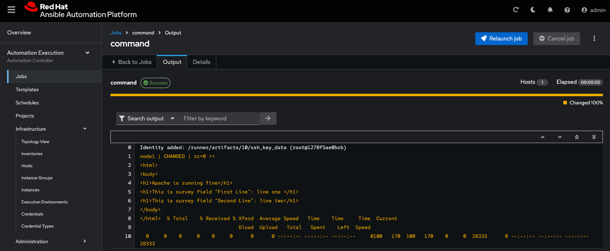

# Exercise - Surveys

**Read this in other languages**:
  [English](README.md),  [日本語](README.ja.md),  [Portuguese do Brasil](README.pt-br.md),  [Française](README.fr.md),  [Español](README.es.md)

## Table of Contents

- [Objective](#objective)
- [Guide](#guide)
- [The Apache-Configuration Role](#the-apache-configuration-role)
- [Create the Project](#create-the-project)
- [Create a Template with a Survey](#create-a-template-with-a-survey)
  - [Create Template](#create-template)
  - [Add the Survey](#add-the-survey)
- [Launch the Template](#launch-the-template)
- [What About Some Practice?](#what-about-some-practice)

## Objective

Demonstrate the use of the Ansible Automation Controller [survey feature](https://docs.ansible.com/automation-controller/latest/html/userguide/job_templates.html#surveys). Surveys allow for setting extra variables for the playbook, similar to ‘Prompt for Extra Variables,’ but in a user-friendly Q&A format. They also allow for validation of user input.

## Guide

You've installed Apache on all hosts in the job you just ran. Now, let's build on this:

- Use a proper role that includes a Jinja2 template to deploy an `index.html` file.
- Create a job **Template** with a survey to collect values for the `index.html` template.
- Launch the job **Template**.

Additionally, the role will ensure that the Apache configuration is set up correctly for this exercise.

> **Tip**  
> The survey feature provides a simple query for data but does not support dynamic data queries, nested menus, or four-eye principles.

### The Apache-Configuration Role

The playbook and role with the Jinja2 template are located in the GitHub repository [https://github.com/ansible/workshop-examples](https://github.com/ansible/workshop-examples) in the `rhel/apache` directory.

- Have a look at the playbook `apache_role_install.yml`, which references the role.
- The role is located in the `roles/role_apache` subdirectory.
- Inside the role, note the two variables in the `templates/index.html.j2` template file marked by `{{…​}}`.
- The `tasks/main.yml` file deploys the template.

The playbook creates a file (**dest**) on the managed hosts from the template (**src**).

Because the playbook and role are located in the same GitHub repo as the `apache_install.yml` playbook, you don't need to configure a new project for this exercise.

### Create a Template with a Survey

Now, let's create a new Template that includes a survey.

#### Create Template

1. Go to **Automation Execution → Templates**, click the **Create template** button, and choose **Create job template**.

2. Fill out the following details:

| Parameter                  | Value                           |
|-----------------------------|---------------------------------|
| Name                        | Create index.html               |
| Job Type                    | Run                             |
| Inventory                   | Workshop Inventory              |
| Project                     | Workshop Project                |
| Playbook                    | `rhel/apache/apache_role_install.yml` |
| Execution Environment        | Default execution environment   |
| Credentials                 | Workshop Credential             |
| Limit                       | web                             |
| Options                     | Privilege Escalation            |

3. Click **Create job template**.

> **Warning**  
> **Do not run the template yet!**

#### Add the Survey

1. In the Template, click the **Survey** tab, then click **Create survey question**.
2. Fill out the following for the first survey question:

| Parameter                  | Value           |
|-----------------------------|-----------------|
| Question                    | First Line      |
| Answer Variable Name        | first_line      |
| Answer Type                 | Text            |

3. Click **Create survey question**.
4. Click **Create survey question** to create a second survey question:

| Parameter                  | Value           |
|-----------------------------|-----------------|
| Question                    | Second Line     |
| Answer Variable Name        | second_line     |
| Answer Type                 | Text            |

5. Click **Create survey question**.
6. Enable the survey by toggling the **Survey disabled** button to the on positon.

### Launch the Template

Now, launch the **Create index.html** job template by clicking the **Launch template** button.

Before the job starts, the survey will prompt for **First Line** and **Second Line**. Enter your text and click **Next**. The **Preview** window shows the values—if all looks good, click **Finish** to start the job.

Once the job completes, verify the Apache homepage by running the following `curl` command in the SSH console on the control host:

Go to Automation Execution → Infrastructure → Inventories → Workshop Inventory

In the **Automation Execution → Infrastructure → Inventories → Workshop Inventory, select the Hosts tab and select node1 and click Run Command

Within the Details window, select Module command, in Arguments type `curl http://node1` and click Next.

Within the Execution Environment window, select Default execution environment and click Next.

Within the Credential window, select Workshop Credentials and click Next.

Review your inputs and click Finish.

Verify that the output result is as expected.

---
**Navigation**
 


[Previous Exercise](../4-variables) - [Next Exercise](../../ansible_rhel_90/6-system-roles/)

[Previous Exercise](../2.3-projects) - [Next Exercise](../2.5-rbac)


