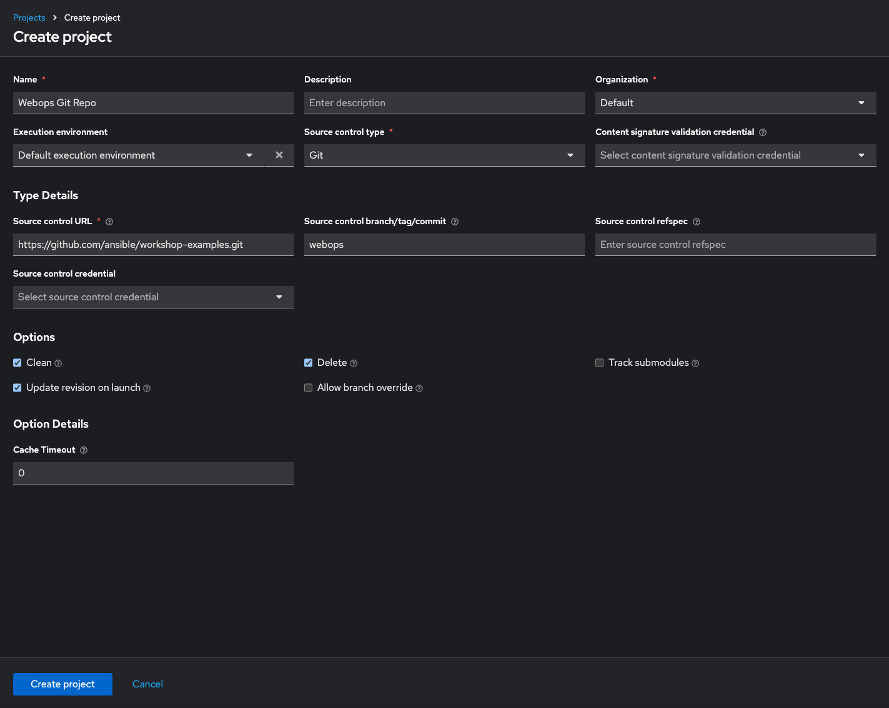

# Workshop Exercise - Workflows

**Read this in other languages**:  
 [English](README.md), [日本語](README.ja.md),  [Portugues do Brasil](README.pt-br.md),  [Française](README.fr.md),  [Español](README.es.md).

## Table of Contents

* [Objective](#objective)
* [Guide](#guide)
  * [Lab scenario](#lab-scenario)
  * [Set up projects](#set-up-projects)
  * [Set up job templates](#set-up-job-templates)
  * [Set up the workflow](#set-up-the-workflow)
  * [Launch workflow](#launch-workflow)

## Objective

The purpose of a workflow is to link multiple job templates together. These templates may or may not share inventory, playbooks, or permissions. The links can be conditional:

* If Job Template A succeeds, Job Template B is executed next.
* If it fails, Job Template C runs instead.

Workflows can include not only job templates but also project or inventory updates.

This flexibility allows different teams to collaborate efficiently. For example, a networking team can manage its own repositories and inventories, while an operations team handles other aspects. In this lab, you’ll learn how to set up a workflow.

## Guide

### Lab scenario

You have two departments in your organization:

* **Web operations team:** developing playbooks in their Git branch `webops`.
* **Web developers team:** working in their branch `webdev`.

When a new Node.js server is needed, the following tasks must be performed:

#### Web operations team tasks

* Install `httpd`, `firewalld`, and `node.js`.
* Configure `SELinux` settings, open the firewall, and start `httpd` and `node.js`.

#### Web developers team tasks

* Deploy the latest version of the web application and restart `node.js`.

The web operations team sets up the server, and the developers deploy the application.

> **Note:**  
> For this example, both teams use branches of the same Git repository. In a real scenario, your source control structure may vary.

---

### Set up projects

First, set up the Git repositories as projects.

> **Warning:**  
> If logged in as **wweb**, log out and log in as **admin**.

Within **Automation Execution** -> **Projects**, click **Create Project** to set up the web operations team’s project:

<table>
  <tr>
    <th>Parameter</th>
    <th>Value</th>
  </tr>
  <tr>
    <td>Name</td>
    <td>Webops Git Repo</td>
  </tr>
  <tr>
    <td>Organization</td>
    <td>Default</td>
  </tr>
    <tr>
    <td>Execution Environment</td>
    <td>Default execution environment</td>
  </tr>
  <tr>
    <td>Source control type</td>
    <td>Git</td>
  </tr>
  <tr>
    <td>Source control URL</td>
    <td><code>https://github.com/ansible/workshop-examples.git</code></td>
  </tr>
  <tr>
    <td>Source control branch/tag/commit</td>
    <td><code>webops</code></td>
  </tr>
  <tr>
    <td>Options</td>
    <td><ul><li>✓ Clean</li><li>✓ Delete</li><li>✓ Update Revision on Launch</li></ul></td>
  </tr>
</table>

Click **Create project**. 

Repeat the process to set up the **Webdev Git Repo**, using the branch `webdev`.
<table>
  <tr>
    <th>Parameter</th>
    <th>Value</th>
  </tr>
  <tr>
    <td>Name</td>
    <td>Webdev Git Repo</td>
  </tr>
  <tr>
    <td>Organization</td>
    <td>Default</td>
  </tr>
    <tr>
    <td>Execution Environment</td>
    <td>Default execution environment</td>
  </tr>
  <tr>
    <td>Source control type</td>
    <td>Git</td>
  </tr>
  <tr>
    <td>Source control URL</td>
    <td><code>https://github.com/ansible/workshop-examples.git</code></td>
  </tr>
  <tr>
    <td>Source control branch/tag/commit</td>
    <td><code>webdev</code></td>
  </tr>
  <tr>
    <td>Options</td>
    <td><ul><li>✓ Clean</li><li>✓ Delete</li><li>✓ Update Revision on Launch</li></ul></td>
  </tr>
</table>

---

### Set up job templates

Within **Automation Execution** -> **Templates** -> **Create template** -> **Create job template**, fill out the form with the following values:

<table>
  <tr>
    <th>Parameter</th>
    <th>Value</th>
  </tr>
  <tr>
    <td>Name</td>
    <td>Web App Deploy</td>
  </tr>
  <tr>
    <td>Inventory</td>
    <td>Workshop Inventory</td>
  </tr>
  <tr>
    <td>Project</td>
    <td>Webops Git Repo</td>
  </tr>
  <tr>
    <td>Playbook</td>
    <td><code>rhel/webops/web_infrastructure.yml</code></td>
  </tr>
  <tr>
    <td>Execution Environment</td>
    <td>Default execution environment</td>
  </tr>
  <tr>
    <td>Credentials</td>
    <td>Workshop Credentials</td>
  </tr>
  <tr>
    <td>Options</td>
    <td>tasks need to run as root so check **Privilege Escalation**</td>
  </tr>
</table>

Click **Create job template**, and then repeat the process for the **Node.js Deploy** template, changing the project to **Webdev Git Repo** and the playbook to `rhel/webdev/install_node_app.yml`.

---

### Set up the workflow

Within **Automation Execution** -> **Templates** -> **Create template** -> **Create workflow job template**, fill in the details:

<table>
  <tr>
    <th>Parameter</th>
    <th>Value</th>
  </tr>
  <tr>
    <td>Name</td>
    <td>Deploy Webapp Server</td>
  </tr>
</table>

Click **Create workflow job template** to open the **Workflow Visualizer**. 

Click the **Add Step** button and assign the **Web App Deploy** job template to the first node. Add a second node by clicking the 3 dot sign, selecting the "Add step and link"  and assign the **Node.js Deploy** template with the **Run on success** status type. Select **Next** and **Finish** to complete the workflow.

Click **Save** to finalize the workflow.

---

### Launch workflow

Within the **Deploy Webapp Server** template, click **Launch template**. 

Once the workflow completes, verify the result.

Go to Automation Execution → Infrastructure → Inventories → Workshop Inventory

In the **Automation Execution → Infrastructure → Inventories → Workshop Inventory, select the Hosts tab and select node1 and click Run Command

Within the Details window, select Module command, in Arguments type `curl http://node1/nodejs` and click Next.

Within the Execution Environment window, select Default execution environment and click Next.

Within the Credential window, select Workshop Credentials and click Next.

Review your inputs and click Finish.

Verify that the output result shows `Hello World`

---
**Navigation**
 
[Previous Exercise](../2.5-rbac) - [Next Exercise](../2.7-wrap)

[Click here to return to the Ansible for Red Hat Enterprise Linux Workshop](../README.md#section-2---ansible-tower-exercises)
